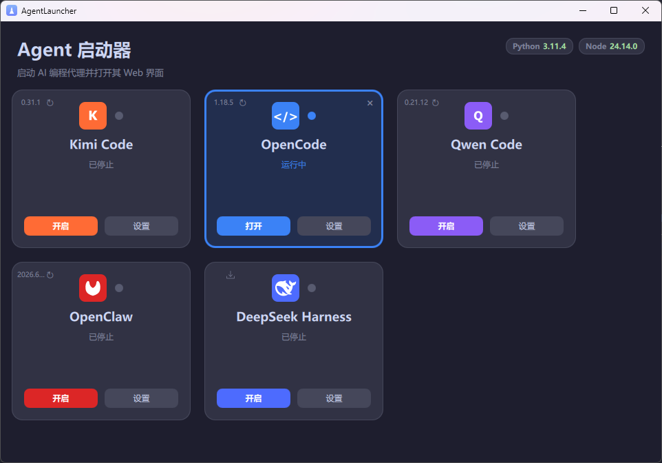

# AgentLauncher

A small Qt6/QML + C++ desktop app that launches the **web UI** of several AI
coding agents (Kimi Code, OpenCode, Qwen Code) from a single card grid, and
quickly opens their config directories. Everything is **config-driven** — new
agents are added by editing a JSON file, no code changes required.



> The screenshot above shows the UI running in Chinese locale; the app follows
> the system language automatically.

## Why

Each AI coding agent has its own CLI and its own way of starting a local web
server, with different default ports and different config directory layouts.
Remembering every command is tedious. AgentLauncher gives you one place to
start any of them and jump straight into its web UI.

## Features

- **Card grid** home screen listing every configured agent.
- **Start** button launches the agent's web server (detached process).
- **Configure** button opens a per-agent settings page (edit command / web URL,
  open the config directory).
- **Running state** detected by an HTTP health check; running cards are
  highlighted with the agent's own color and a colored border.
- Click a **running** card to open the web UI in your default browser.
- **Stop** button (×) on running cards terminates agents that were started
  from this session.
- **Runtime version badges** in the top-right corner show detected Python and
  Node.js versions; missing runtimes are highlighted so you know which agents
  may not work.
- **Version labels** on each card show the installed agent version when the
  `versionCommand` is configured.
- **Fully config-driven** via `agents.json`.

## Quick start

```bash
cmake -B build -DCMAKE_PREFIX_PATH="C:/Qt/6.7.3/msvc2019_64"
cmake --build build
./build/AgentLauncher
```

See [Configuration](configuration.md) for adding your own agents, and
[Development](development.md) for build details.
