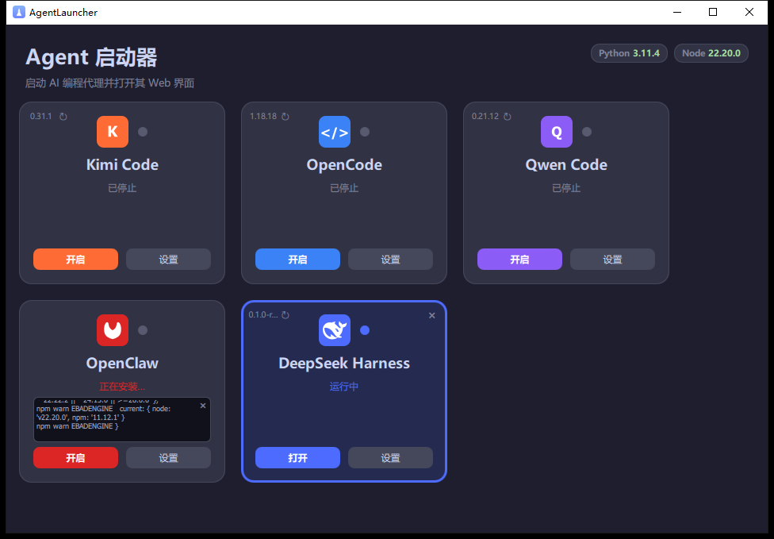

# AgentLauncher介绍

这半年 AI agent 一个接一个地冒出来——`OpenClaw`、`OpenCode`、`Kimi Code`、`Qwen Code`，最近又来了个 `DeepSeek Harness`。每一个我都用过，试完发现一个问题：它们的启动命令我根本记不住。

Kimi 是 `kimi web`，OpenCode 是 `opencode web --port 4096`（还得自己指定端口，不然它每次随机挑一个），Qwen 是 `qwen serve`，`DeepSeek Harness` 是 `dsh web`……端口也各不相同，58627、4096、4170、3080，毫无规律。每次想用哪个，都得翻回它的文档，或者去翻历史命令。

更烦的是 `Qwen Code`。它的 web 端要带一个 `bearer token`，你得先生成一个 `token` 存成文件，启动时再读进去。事情不难，但每换台机器就得重来一遍，特别磨人——明明只是想打开个网页写代码，却要先跟 PowerShell 较劲生成一串 GUID。

还有 `DeepSeek Harness`，最近刚上线，只给了 `web` 端，没别的入口，又多一个启动命令 `dsh web`，单看每一个都不复杂，但全攒到一起，就是一层又一层的麻烦。

有时候想全部更新一下电脑里的agent工具，又得找一遍命令，谁记得`npm install`后面是什么。

于是我用AI写了个小工具：`AgentLauncher`。

思路很简单——把所有 agent 塞进一个卡片网格，每个一张卡。点一下启动，就直接用默认浏览器打开它的 web 端，不用再手敲地址。卡片上还会标出这个 agent 装没装、版本是多少。启动过程不弹控制台，一个软件管理所有agent的启动和更新。工具能看到你电脑哪些agent启动了，也可以关闭掉对应agent工具。

像 DeepSeek Harness 这种只有 web 端的新工具，用这个就是：点安装，等输出跑完，点启动，点卡片打开网页。三步，不用记命令，不用查端口，不用自己开浏览器。

这个工具所有配置全写在一个 `agents.json` 里。新 agent 只要支持npm安装都能集成进去。

还可以进行一些初始化配置，例如`Qwen Code`需要生成一个token相对麻烦很多，通过 `setupCommand` 字段，第一次启动 agent会执行一个初始化命令，针对类似`Qwen Code`生成 token问题，之后就再也不用管。哪天 token 出了问题，右键菜单里有个“重新初始化”，点一下重来就行。

AgentLauncher 使用了QML,C++开发，不依赖electron这种重架构，轻量美观，我觉得ai开发GUI端工具，像QML这种高性能框架可以多考虑，既美观也好调试，整个工具的开发使用了`ZCode`\`Kimi Code` + `glm5.2` 总体所有任务都一步到位基本没有什么问题

开源地址：
[gitee:https://gitee.com/czyt1988/start-agent](https://gitee.com/czyt1988/start-agent)
[github:https://github.com/czyt1988/AgentLauncher](https://github.com/czyt1988/AgentLauncher)
